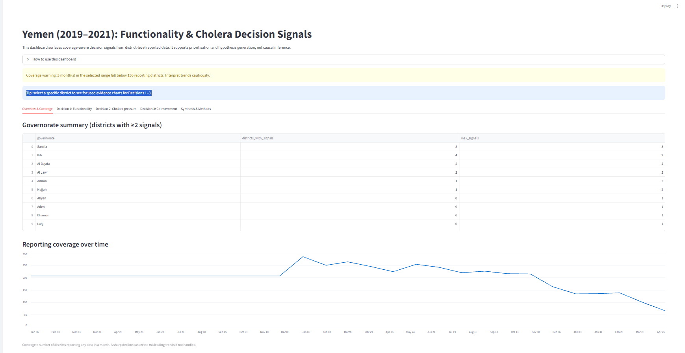
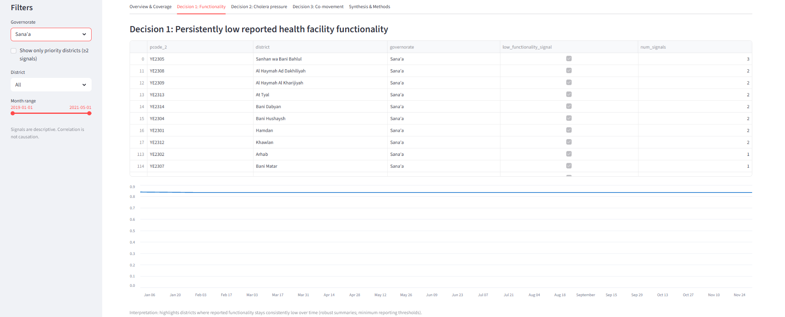
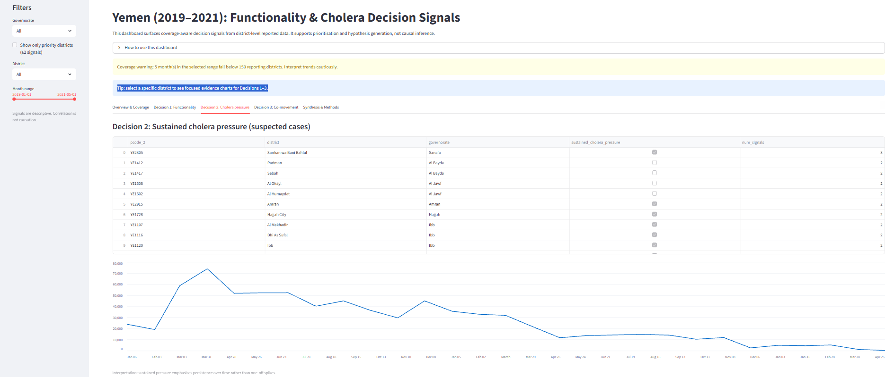
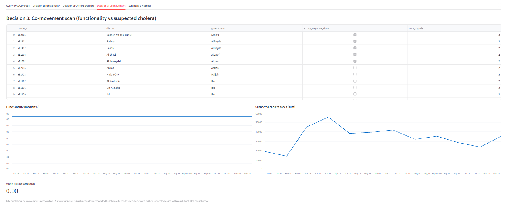

# Yemen Health Functionality and Cholera Signals (2019–2021)

District-level analysis of reported health service functionality and suspected cholera trends in Yemen, with explicit treatment of data quality, coverage gaps, and analytical limitations to support cautious humanitarian decision-making.

This project explores district-level patterns in health system functionality and suspected cholera cases in Yemen between 2019 and 2021 using publicly available humanitarian health data. The aim is not to predict outcomes or assess programme performance, but to support prioritisation and sense-making in a context where data is incomplete, reporting is uneven, and decisions often need to be made under uncertainty.

---

## How this analysis works

The analysis begins with a full data quality review, including the identification of duplicate records, inconsistent geographic fields, and changes in reporting coverage over time. A substantial decline in the number of reporting districts is observed in 2021, and this is explicitly accounted for to avoid interpreting data availability issues as real-world trends.

Three complementary decision signals are then developed:

- **Persistently low reported health facility functionality**
- **Sustained cholera pressure**, based on repeated months of elevated suspected case counts
- **Within-district co-movement** between functionality and suspected cholera cases over time

Rather than combining these indicators into a single index, signals are allowed to converge naturally. This highlights districts where multiple independent stress signals align, while preserving transparency about which signals are driving inclusion.

The outputs are designed to support further investigation, planning discussions, and interactive exploration rather than to provide definitive assessments.

All findings should be interpreted alongside contextual and qualitative information.

For detailed methods, assumptions, and limitations, see `docs/analytical_framework.md`.

---

## Run locally

1. Clone this repository
2. Install dependencies:
   ```bash
   pip install -r requirements.txt

## Data source

Raw data is publicly available from the ACAP/ACAPS website.  
This repository does not include the raw file. To reproduce:

1) Download the dataset
2) Save it as: `data_raw/yemen-core-dataset-health.csv`
3) Run the notebooks / pipeline as described in `data_pipeline_design.md`

## Dashboard snapshots






🔗 **Live demo:** 
https://yemen-health-functionality-cholera.streamlit.app/